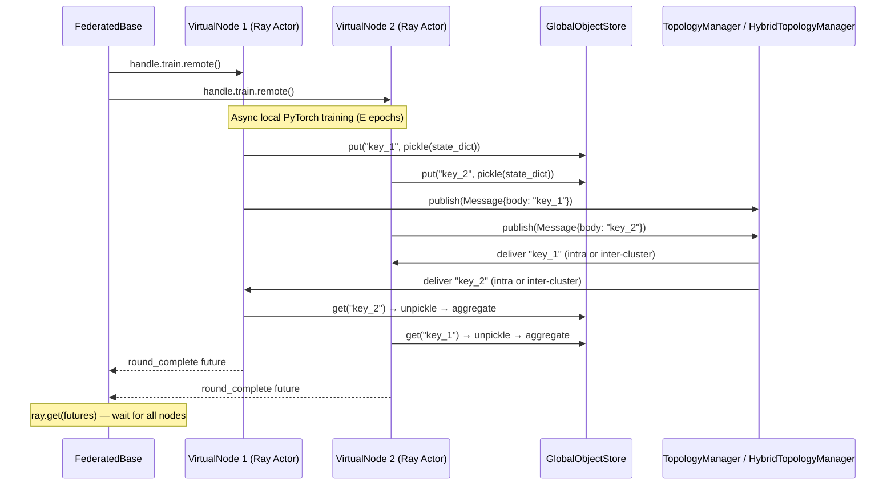

# Federated Base Coordinator

The `FederatedBase` class (`src/core/federated/federated_base.py`) is the invisible conductor of the entire local simulation. It owns the full lifecycle of a federated experiment: resource allocation, node materialization, round orchestration, and teardown.

Every executor in `app_factory.py` instantiates some form of `FederatedBase` before entering the training loop.

---

## Responsibilities

### 1. Resource Allocation

Before any node boots, `FederatedBase` calculates the total required CPU/GPU resources across all virtual nodes and creates a Ray **PlacementGroup**. This guarantees that all nodes have secured hardware resources before the training loops start — preventing the deadlock scenario where some nodes boot, consume resources, and then block others from materializing.

```python
# Typical pattern in an executor
base = FederatedBase(config)
base.allocate_resources()   # Reserves PlacementGroup
base.materialize_all()      # Boots all VirtualNode actors
```

### 2. Lazy Node Mapping

`FederatedBase` holds the list of `VirtualNode` objects and exposes Python dictionary-like indexing to fetch exact Ray actor handles:

```python
node = base["client_7"]          # Returns VirtualNode
actor = node.handle              # Returns live ray.actor.ActorHandle
```

Nodes are only materialized (real Ray actors created, PyTorch models loaded) when first accessed. This allows the coordinator to manage thousands of conceptual nodes with near-zero idle RAM.

### 3. Global Control Plane

`FederatedBase` provides unified `train()`, `test()`, and `stop()` methods. When you call `base.train()`, it fires off asynchronous `.remote()` calls to all active virtual nodes simultaneously — triggering the federated round across the cluster in parallel.

### 4. Interactive Messaging

During complex setups (e.g., Hybrid multi-cluster deployments), the base coordinator can use `self.send(header, body, to=node_id)` to manually push control messages directly to specific nodes for synchronization.

---

## The Coordination Sequence

Consider the sequence diagram for a single federated training round:



The `FederatedBase` blocks on `ray.get()` until all in-flight futures resolve, then increments the round counter and starts the next cycle.

---

## Relationship to the ICRF

In **single-cluster** mode, `FederatedBase` uses the standard `TopologyManager` actor for routing. In **multi-cluster** (ICRF) mode, the `HybridTopologyManager` replaces it transparently — `FederatedBase` sees no difference. The same `train()` call works across one machine or across a continent-spanning data center federation.

See also: [Ray & Virtual Nodes](../orchestration/ray_and_virtual_nodes.md) · [Inter-Cluster Ray Fabric (ICRF)](icrf.md)
