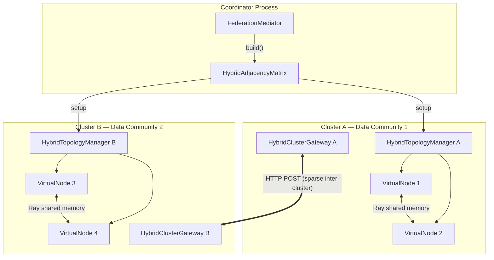
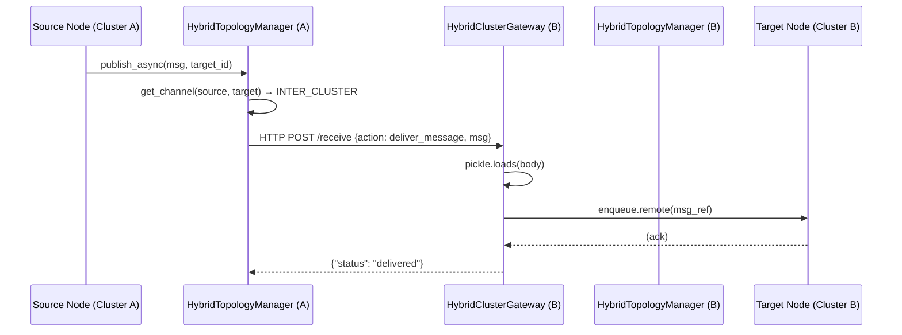

# Inter-Cluster Ray Fabric (ICRF)

The **Inter-Cluster Ray Fabric (ICRF)** is the core architectural primitive of FedPilot. It is a hybrid communication substrate that enables massive horizontal scaling by seamlessly switching underlying transport protocols based on physical node placement, while preserving a single logical federation graph.

Rather than being a static network layer, the ICRF uses **data-driven clustering** to dynamically determine its own wiring. By analyzing the statistical distribution of data across clients, the ICRF optimizes physical placement to group similar clients together, drastically improving convergence while minimizing expensive cross-cluster network traffic.

---

## Design Principle

Traditional federated learning frameworks either simulate a network on a single machine or require rigid, point-to-point network configurations that break logical topologies when spanning different physical clusters.

FedPilot solves this with the ICRF:
- If two logical neighbors (e.g., in a Ring or K-Connected topology) are assigned to the **same** physical Ray cluster → ICRF routes their messages via fast, native Ray actor references and the shared `GlobalObjectStore`.
- If two logical neighbors are on **different** Ray clusters → ICRF intercepts the message and routes it across the network through gateway-mediated HTTP transport.

**Why this matters:**
1. **Topology Agnosticism**: Application code does not need to branch on locality. A custom adjacency-matrix graph can span multiple data centers without the researcher writing a single line of networking code.
2. **Resource Proximity**: Federated learning modules can be deployed physically close to their own heavy data domains while still participating in a single, unified experimental graph.
3. **Scalability Without Proportional Cost**: By using data-driven clustering to maximize intra-cluster traffic, the ICRF keeps the expensive inter-cluster gateway calls sparse and periodic.

---

## Data-Driven Placement Strategy

The defining feature of the ICRF is *how* it decides which nodes go to which physical clusters. It uses a **data-driven clustering pipeline** (`src/core/clustering/`) to group clients with similar label distributions.

### Why Data-Driven?
Under severe non-IID conditions, `FedAvg` struggles because clients have highly divergent data distributions, causing their gradients to point in opposite directions. By co-locating clients with similar data characteristics onto the same physical cluster, the ICRF creates "data communities." Within these communities, gradient directions align, local aggregation is stable, and weights are exchanged instantly via Ray shared memory.

### The Pipeline
The ICRF configures itself before training begins using a 4-stage pipeline:
1. **Label Distribution Profiling**: Each client scans its `DataLoader` and produces a label frequency histogram. No raw data ever leaves the client.
2. **Affinity Propagation**: Pairwise cosine similarity is computed between all histograms. Affinity Propagation automatically discovers the optimal number of data communities without a preset cluster count.
3. **LocalityAwareAssignment**: The `FederationMediator` uses Louvain community detection to map these statistical clusters onto physical Ray clusters.
4. **Routing Matrix**: The `HybridAdjacencyMatrix` is built, encoding whether a neighbor is accessible via Ray memory (`INTRA_CLUSTER`) or via the Ray Serve gateway (`INTER_CLUSTER`).

---

## The Full Architecture

The ICRF is composed of five tightly integrated components:



### 1. FederationMediator
The **build-time** orchestrator. It orchestrates cluster discovery, executes the data-driven clustering pipeline, runs the assignment strategy, and distributes the `HybridAdjacencyMatrix` to all worker clusters.

### 2. HybridAdjacencyMatrix
The **central data structure** — a runtime routing table disguised as an adjacency matrix. It stores each neighbor's physical cluster address and Ray Serve gateway port.

### 3. HybridTopologyManager
The **runtime message router** on each cluster (`@ray.remote`). When a node publishes a message, this manager consults the matrix to decide whether to use direct Ray actor calls (shared memory) or HTTP POST (remote gateway).

### 4. HybridClusterGateway
The **Ray Serve deployment** — the HTTP ingress point for each cluster. It receives inter-cluster messages and enqueues them to the local target actors.

### 5. Descriptors
`NodeDescriptor` and `ClusterDescriptor` dataclasses form the vocabulary, storing IPs, ports, and cluster boundaries.

---

## The Message Flow: End-to-End



For intra-cluster messages, the HTTP POST and gateway are bypassed entirely — the `HybridTopologyManager` calls `enqueue.remote()` directly on the local actor handle.

---

## Configuration

The ICRF is highly configurable in `config.yaml`:

```yaml
do_cluster: true                            # Enable ICRF data-driven placement
clustering_period: 6                        # Re-cluster and rewire the ICRF every 6 rounds
pre_computed_data_driven_clustering: false  # true = load assignments from file
use_global_accuracy_for_noniid: true        # Measure convergence with a global metric
```

**Activation**: The ICRF triggers automatically when the hybrid environment variables are set:
```bash
export CLUSTER_0_ID=coordinator
export CLUSTER_ID=coordinator
export HYBRID_ASSIGNMENT_STRATEGY=locality
```

---

## Related Components
| Component | Role |
|-----------|------|
| [Topology Manager](../orchestration/topology_manager.md) | Single-cluster routing (non-hybrid mode) |
| [Topology Adaptation Registry](../registries/topology_adaptation_registry.md) | Strategies for rewiring the ICRF between rounds |
| [Applications & AppFactory](../schemas_and_apps/applications_and_appfactory.md) | ICRF activates via `hybrid_coordinator_executor` / `hybrid_worker_executor` |
| [Federated Base](federated_base.md) | Manages node lifecycle and resource allocation |

