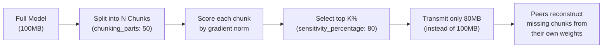

# Model Compression & Chunking

FedPilot implements a gradient-guided model compression system called **Chunking** (`src/core/pruning/` and `src/applications/torrent/`). It dramatically reduces the communication bandwidth needed per federation round by transmitting only the most important slices of the model.

## The Problem: Bandwidth Bottleneck

A ResNet-50 has ~25 million parameters. At 4 bytes per float, that is **100MB** per upload per round per client. With 50 clients across 100 rounds, that is 500GB of model data movement for one experiment. Chunking solves this.

## How Chunking Works



## Configuration

```yaml
# Enable chunking
chunking: true
chunking_with_gradients: true    # Must be true for gradient-guided importance
chunking_parts: 50               # Split model into 50 segments
chunking_random_section: false   # false = importance-based, true = random selection

# Control what percentage of chunks to transmit
sensitivity_percentage: 80       # Send the top 80% most important chunks
dynamic_sensitivity_percentage: true  # Automatically adapt the threshold each round
```

## Chunk Importance Scoring

With `chunking_with_gradients: true`, FedPilot uses `calculate_optimal_sensitivity_percentage.py` to score each chunk using the **gradient norm** as a proxy for information value:

$$ \text{importance}(i) = \left\| \nabla_{\theta_i} \mathcal{L} \right\|_2 $$

Chunks with the highest gradient norm are the most information-dense and are prioritized for transmission.

## Distance Metrics for Chunk Selection

Chunks are compared using configurable distance metrics, configured via `distance_metric`:

| Metric | Formula | Description |
|--------|---------|-------------|
| `cosine` | $1 - \frac{u \cdot v}{\|u\|\|v\|}$ | Angle between weight vectors |
| `euclidean` | $\|u - v\|_2$ | Geometric distance |
| `coordinate` | $\sum\|u_i - v_i\|$ | Sum of absolute parameter diffs |

## The ChunkAnalyzer (Research Tool)

The `ChunkAnalyzer` class (`src/applications/torrent/chunk_analyzer.py`) provides research utilities:
- `analyze_chunk_distribution(clients, config)` — which chunks are each client selecting?
- `calculate_chunk_overlap(client1_chunks, client2_chunks)` — Jaccard similarity between two clients' selections
- `get_chunk_importance_distribution(client, config)` — statistical summary of importance scores per chunk

These tools are invaluable for understanding communication efficiency in your experiments.
