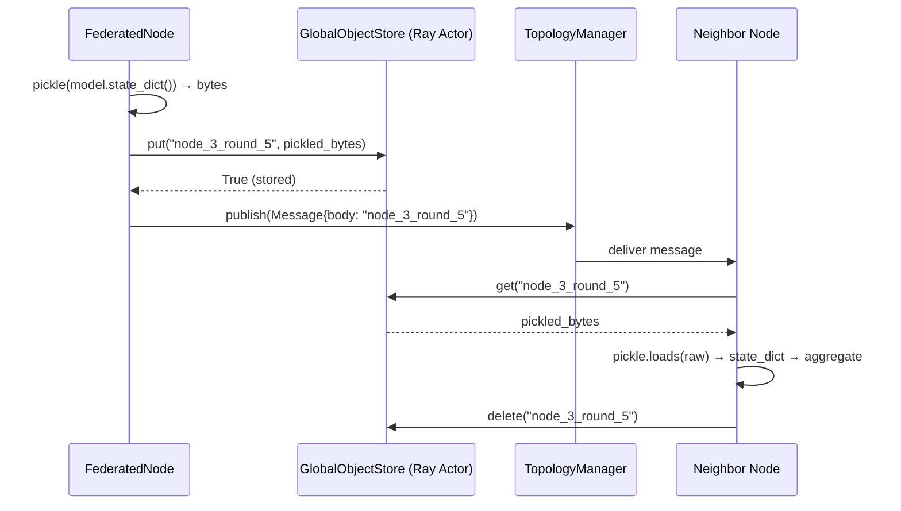

# Global Object Store

Transmitting deep neural network weights over a network is expensive. A ResNet-50 state dict is ~100MB. Passing 100MB dictionaries through Ray's message queue on every round is both slow (serialization overhead) and dangerous (memory bloat that crashes actors).

FedPilot solves this with the `GlobalObjectStore` (`src/core/communication/global_object_store.py`) — a Ray Actor that acts as a distributed in-memory key-value store, similar to Redis but built natively on Ray shared memory.

---

## Design Philosophy: Decouple Signalling from Data

The core insight is that the message bus should carry only **lightweight keys**, while the actual model weights travel through shared memory:

```
Message body = "node_3_round_5"       ← 20 bytes, routed through TopologyManager
GlobalObjectStore["node_3_round_5"]   ← 100MB, accessed directly via Ray shared memory
```

This means the `TopologyManager` (and `HybridTopologyManager`) never touch the weights — they move only the references. The bandwidth consumed by the messaging layer stays constant regardless of model size.

---

## How It Works



---

## Critical API Rule: Pre-Serialize Before Storing

The `GlobalObjectStore` is strict about types. Values **must be pre-serialized as bytes** before storage. The store does not call `pickle.dumps()` for you.

```python
import pickle

# ✅ CORRECT — pre-pickle before storing
pickled = pickle.dumps(self.model.state_dict())
ray.get(self.global_object_store.put.remote("node_3_round_5", pickled))

# Retrieve and unpickle
raw = ray.get(self.global_object_store.get.remote("node_3_round_5"))
state_dict = pickle.loads(raw)

# ❌ WRONG — passing a raw dict raises TypeError inside the actor
ray.get(self.global_object_store.put.remote("key", self.model.state_dict()))
```

> All methods must be called with `.remote()` since the store is a Ray Actor running concurrently in its own process.

---

## Full API Reference

| Method | Signature | Description |
|--------|-----------|-------------|
| `put` | `put(key: str, value: bytes) → bool` | Store a pickled object; returns `True` on success |
| `get` | `get(key: str) → bytes \| None` | Retrieve pickled bytes, or `None` if the key is missing |
| `delete` | `delete(key: str) → bool` | Remove an entry; returns `True` if it existed |
| `keys` | `keys() → List[str]` | List all active keys currently in the store |
| `size` | `size() → int` | Number of entries currently stored |

---

## Key Naming Convention

FedPilot uses a consistent naming scheme for object store keys:

```
{fed_id}/{node_id}/round_{round_number}
```

For example: `"my_experiment/client_7/round_42"`. This namespacing prevents key collisions when multiple federations run concurrently on the same Ray cluster.

---

## ICRF Note

In multi-cluster (ICRF) mode, each Ray cluster runs its own `GlobalObjectStore` instance. Weights that cross cluster boundaries travel via the `HybridClusterGateway` HTTP endpoint (pickled in the message payload), **not** through the shared object store. The object store is an intra-cluster optimization only.

See also: [Topology Manager](topology_manager.md) · [Inter-Cluster Ray Fabric (ICRF)](../federated_core/icrf.md)
