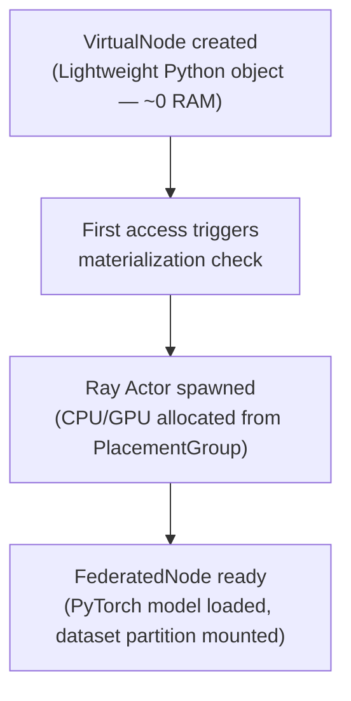

# Ray & Virtual Nodes

FedPilot achieves massive scalability by treating physical hardware as fluid resources via **Ray**. Instead of tying a client directly to a thread or process, the framework uses a lazy-evaluation pattern called `VirtualNode`.

---

## The Problem: Static Instantiation Doesn't Scale

Naïvely spawning 1,000 Ray actors at boot — each loading a PyTorch model and a data partition — would immediately exhaust RAM and GPU memory. Most nodes would be idle most of the time. FedPilot solves this with lazy materialization.

---

## The VirtualNode Lifecycle



### Stage 1 — The Placeholder

During boot, the `FederatedBase` creates a list of `VirtualNode` objects. These are purely Python objects — they contain a string `id` and a configuration dictionary. They consume near-zero memory. A federation of 10,000 conceptual clients can be represented in a few megabytes.

### Stage 2 — On-Demand Materialization

When the coordinator calls `.train()` or `.aggregate()` on a specific client, the `VirtualNode` checks whether it has an active Ray handle. If not, it calls `materialize()`. This requests CPU/GPU resources from the Ray Cluster head and boots up the heavyweight `FederatedNode` actor.

```python
# VirtualNode.materialize() — simplified
if self._handle is None:
    self._handle = FederatedNode.options(
        name=f"{self.fed_id}/{self.node_id}",
        placement_group=self.placement_group,
        placement_group_bundle_index=self.bundle_index,
    ).remote(self.config)
```

### Stage 3 — The FederatedNode Actor

The `FederatedNode` is the actual worker, decorated with `@ray.remote`. Once alive, it:

1. Instantiates the PyTorch model (looked up via the `ModelRegistry`).
2. Loads its specific dataset partition from the configured `dataset_type` and `data_distribution_kind`.
3. Executes the local gradient descent loop for `number_of_epochs` epochs.
4. Pickles the resulting `state_dict` and uploads it to the `GlobalObjectStore`.
5. Publishes the object store key to its neighbors via the `TopologyManager` (or `HybridTopologyManager` in ICRF mode).

---

## Placement Groups

Ray **PlacementGroups** are how FedPilot prevents resource deadlocks.

**The deadlock scenario without PlacementGroups**: 5 nodes start training, consuming all available GPU memory. When they try to communicate, the `TopologyManager` actor cannot be scheduled because there is no GPU left. The system hangs.

**The solution**: `FederatedBase` creates a `PlacementGroup` that reserves *all* required resources *before* spawning any actors. If the cluster cannot satisfy the full group, no actors start — preventing partial allocation deadlocks.

```yaml
# config.yaml
placement_group_strategy: "SPREAD"   # Distribute actors across physical machines
# Alternative: "PACK" (co-locate for maximum shared memory bandwidth)
```

| Strategy | Behaviour | Best For |
|----------|-----------|----------|
| `SPREAD` | One actor per physical machine if possible | Maximum parallelism, multi-GPU servers |
| `PACK` | Co-locate actors on as few machines as possible | Minimizing inter-machine communication |

---

## ICRF Integration

In multi-cluster (ICRF) mode, virtual nodes do not all materialize on the same Ray cluster. The `FederationMediator` assigns each `VirtualNode` to a physical cluster during boot (via `LocalityAwareAssignment` or another strategy). When a node materializes, it materializes *on its assigned cluster* — its actor handle is registered in that cluster's `HybridTopologyManager`.

This means the lazy materialization pattern and the ICRF work together: nodes consume resources only when needed, and only on the cluster where they actually run.

See also: [Federated Base](../federated_core/federated_base.md) · [Inter-Cluster Ray Fabric (ICRF)](../federated_core/icrf.md)

