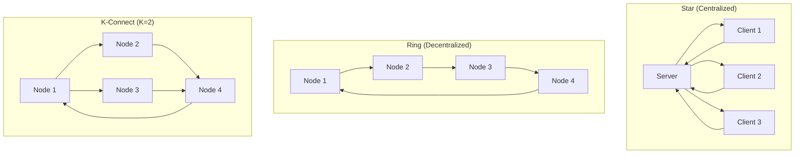
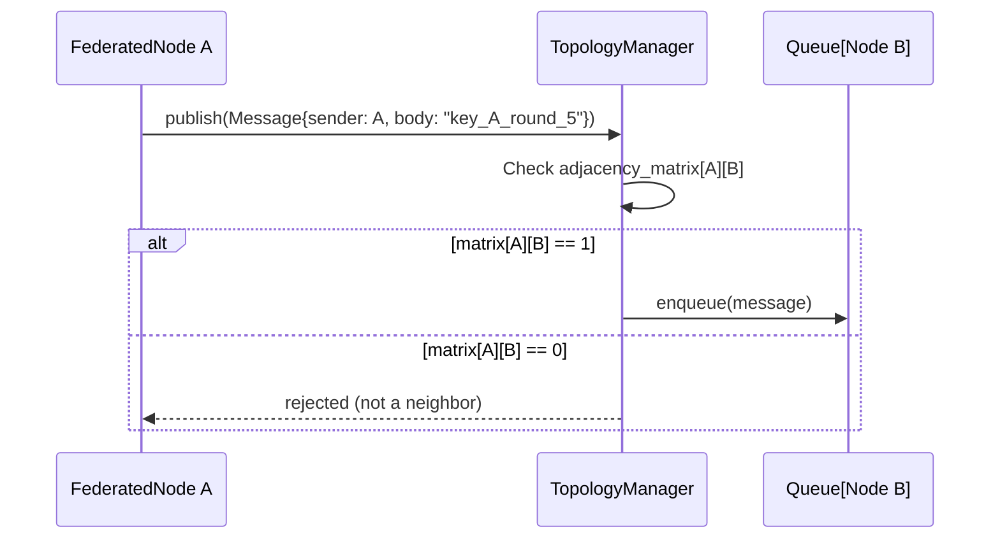

# Topology Manager

In a decentralized network, nodes cannot indiscriminately talk to every other node. They are bounded by a specific physical or logical graph. The `TopologyManager` (`src/core/communication/topology_manager.py`) is the Ray actor responsible for enforcing this graph in **single-cluster** experiments.

> For multi-cluster (ICRF) deployments, the `HybridTopologyManager` replaces this actor — see [Inter-Cluster Ray Fabric (ICRF)](../federated_core/icrf.md).

---

## What It Does

The `TopologyManager` owns three responsibilities at runtime:

1. **Routing enforcement** — consults the adjacency matrix on every `publish()` call to ensure messages only flow along valid edges.
2. **Queue management** — maintains an incoming message queue for each node; messages wait here until the node calls `sync()` to retrieve them.
3. **Topology adaptation** — calls the registered `TopologyAdaptationStrategy` at the end of each round and swaps in the updated adjacency matrix.

---

## Visualizing Topologies

The `TopologyManager` enforces the following built-in network structures (and any custom adjacency matrix you define):



---

## The Adjacency Matrix

Every topology is ultimately resolved into a NumPy **adjacency matrix**:

- An $N \times N$ binary matrix.
- `matrix[i][j] = 1` means Node $i$ can send messages to Node $j$.
- The diagonal is always `0` (no self-messages).
- Custom topologies defined via `@register_topology` return this same NumPy matrix.

The `TopologyManager` loads this matrix at boot and uses it for every routing decision throughout the experiment.

---

## Message Routing

When a `FederatedNode` finishes a training round, it constructs a `Message` and calls `TopologyManager.publish()`:



Later, when Node B calls `sync()`, it drains its queue and retrieves all pending messages from the current round.

By centralizing routing into a single actor, researchers can implement arbitrarily complex application logic without inadvertently violating the network graph constraints of their experiment.

---

## Topology Adaptation

At the end of each round, the `TopologyManager` calls the registered `TopologyAdaptationStrategy`:

```python
new_matrix = strategy.adapt(
    adjacency_matrix=current_matrix,
    node_weights=all_latest_weights,
)
self._adjacency_matrix = new_matrix  # Hot-swap the graph
```

This enables dynamic rewiring between rounds — for example, connecting nodes whose models have diverged to accelerate their reconciliation.

See the [Topology Adaptation Registry](../registries/topology_adaptation_registry.md) to learn how to register custom adaptation strategies.

---

## Topology Configuration

```yaml
federated_learning_topology: "k_connected"   # ring | k_connected | star | custom
k_value: 3                                   # Neighbors per node in k_connected
adjacency_matrix_file_name: null             # Path to a custom .csv adjacency matrix
```

Custom topologies are registered via `@register_topology` in the [Topology Registry](../registries/topology_registry.md).
