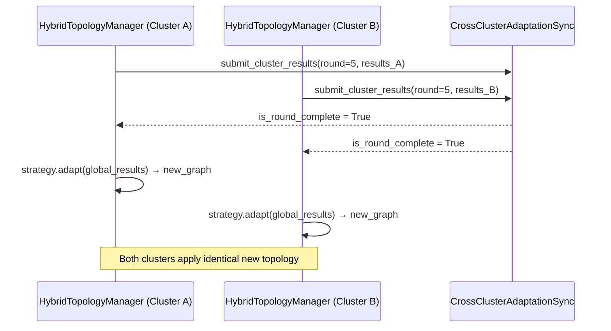

# Topology Adaptation Registry

The Topology Adaptation Registry (`src/registries/topology_adaptation/topology_adaptation_registry.py`) is the **4th built-in plugin system**. It governs how the network graph *changes dynamically* over the course of a training run — for both single-cluster and ICRF multi-cluster deployments.

In standard FL, the network graph (e.g., Ring, Star) is fixed for the entire experiment. The Topology Adaptation layer allows the graph to reorganize itself **between rounds** based on observed metrics — for example, clustering nodes with diverged models into denser sub-graphs, or pruning underperforming edges.

---

## `@register_adapter` — Dynamic Topology Strategy

Registers a topology adaptation strategy that the coordinator calls at the end of each federated round.

```python
from src.registries.topology_adaptation.topology_adaptation_registry import register_adapter
from src.registries.topology_adaptation.topology_adaptation_strategies import TopologyAdaptationStrategy

@register_adapter("cosine_similarity_rewire")
class CosineSimilarityRewire(TopologyAdaptationStrategy):
    
    @property
    def is_adaptable(self) -> bool:
        return True
    
    def adapt(self, results: dict, current_topology) -> networkx.Graph:
        """
        Recompute which nodes should be connected based on cosine
        similarity of their weight vectors. Return a new nx.Graph.
        """
        # results: {"accuracy": {"client_0": 0.82, ...}, ...}
        # current_topology: networkx.Graph
        new_graph = rewire_by_similarity(current_topology, results)
        return new_graph
```

Once registered, activate in `config.yaml`:

```yaml
topology_adaptation_strategy: "cosine_similarity_rewire"
```

---

## Built-In Strategies

| Strategy | File | `is_adaptable` | Description |
|----------|------|--------------|-------------|
| `static` | `static_topology_strategy.py` | `False` | No adaptation — graph is fixed for the entire run. This is the default. |
| `dynamic_test` | `test_dynamic_topology_strategy.py` | `True` | A reference implementation showing how to return a rewired graph |

---

## The Adaptation Contract

Your `adapt()` method receives two arguments:

| Argument | Type | Contents |
|----------|------|----------|
| `results` | `dict` | Aggregated per-node metrics from the round (accuracy, loss, gradient norm, etc.) |
| `current_topology` | `networkx.Graph` | The current federation graph — modify a copy, return the new graph |

Return value: a **new `networkx.Graph`** with the updated edge set. The `TopologyManager` (or `HybridTopologyManager`) will hot-swap this graph before the next round begins.

**Important**: Your strategy must be stateless between rounds or manage its own state internally. The registry instantiates it once at boot.

---

## How It Connects to the ICRF

In multi-cluster (ICRF) mode, topology adaptation is coordinated across clusters by the `CrossClusterAdaptationSync` Ray Actor. Each cluster's `HybridTopologyManager` collects local node results, submits them to the sync actor, then waits for the global round to complete before applying the new graph via `HybridAdjacencyMatrix.graph = new_graph`.

This means your custom `adapt()` function runs identically in single-cluster and multi-cluster mode. You write the algorithm; the ICRF handles the cross-cluster coordination.



---

## Use Cases

- **Model-similarity rewiring**: Connect nodes whose weight vectors have diverged to accelerate reconciliation.
- **Clustered federated learning**: Dynamically group nodes by gradient similarity, eliminating the need for pre-computed clusters.
- **Fault tolerance**: Remove edges to nodes that have been unavailable for multiple rounds.
- **Curriculum learning**: Start with a dense graph and progressively sparsify as the model converges.

See also: [Topology Registry](topology_registry.md) · [Inter-Cluster Ray Fabric (ICRF)](../federated_core/icrf.md)

