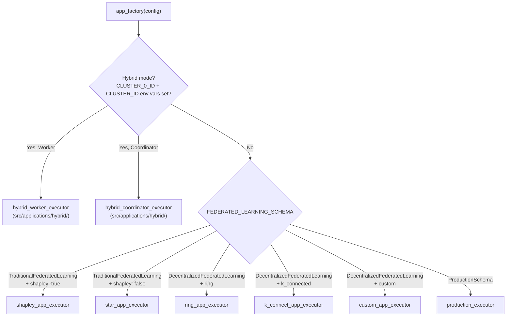

# Applications & AppFactory

While Schemas define *what* nodes do, **Applications** define the concrete execution pathways. Located in `src/applications/`, each application maps a Schema onto a specific Ray topology, resource layout, and node role configuration.

`app_factory.py` is the single dispatcher that reads your `config.yaml` and returns the correct executor.

---

## The Full Executor Map



---

## Executor Reference

### `star_app_executor`
The standard centralized executor. One `StarServerNode` aggregates updates from all `StarClientNode` actors each round via `FedAvg` or `FedProx`.
- **Schema**: `TraditionalFederatedLearning`
- **Topology**: Star (server ↔ clients)
- **Routing**: Standard `TopologyManager`

### `shapley_app_executor`
Extends the star executor with a `ShapleyServerNode` that computes **Shapley values** after each round — a game-theory metric for measuring each client's marginal contribution to model quality.
- **Enabled via**: `shapley: true` in config
- **Use case**: Fairness analysis, identifying free-riders

### `ring_app_executor` / `k_connect_app_executor` / `custom_app_executor`
The three decentralized executors. No central server exists. All nodes are peers that train locally and synchronize only with their topological neighbors via the `GlobalObjectStore`.
- **Schema**: `DecentralizedFederatedLearning`
- **Routing**: Standard `TopologyManager` enforcing the ring/K-connected/custom adjacency matrix

### `hybrid_coordinator_executor` / `hybrid_worker_executor`
Multi-cluster deployment across physically separate Ray clusters. Activated automatically when `CLUSTER_0_ID` and `CLUSTER_ID` are both set as environment variables.

- The **coordinator** runs `FederationMediator`, builds the `HybridAdjacencyMatrix`, and distributes it to all worker clusters via the `HybridClusterGateway`.
- Each **worker** spins up its local `HybridTopologyManager`, registers its nodes with the gateway, and begins training. Intra-cluster weight exchange uses Ray shared memory; inter-cluster weight exchange uses HTTP.
- See [Inter-Cluster Ray Fabric (ICRF)](../federated_core/icrf.md) for the full architecture.

### `production_executor`
A hardened executor designed for stable long-running deployments. Reduced logging overhead, production-safe error handling, and `production_mode: true` in config.

---

## Schema Constants

| `config.yaml` value | Python Constant | Executor |
|---------------------|----------------|----------|
| `TraditionalFederatedLearning` | `TRADITIONAL_FEDERATED_LEARNING` | `star_app_executor` |
| `DecentralizedFederatedLearning` | `DECENTRALIZED_FEDERATED_LEARNING` | `ring/k_connect/custom` |
| `ProductionSchema` | `PRODUCTION_SCHEMA` | `production_executor` |

> Hybrid mode is not schema-driven — it is environment-variable-driven. Any schema can be deployed in hybrid mode by setting the cluster environment variables.

---

## Extending AppFactory

To add a new executor, register it in `app_factory.py`:

```python
from src.applications.my_custom_executor import my_custom_executor

# Inside the dispatcher logic:
elif config.FEDERATED_LEARNING_SCHEMA == "MyCustomSchema":
    return my_custom_executor(config)
```

Your executor function receives the fully-validated `ConfigValidator` object and is responsible for building the `FederatedBase`, creating nodes, and running the training loop.

See also: [Schemas SDK](schemas_sdk.md) · [Inter-Cluster Ray Fabric (ICRF)](../federated_core/icrf.md) · [Shapley Value Analysis](../federated_core/shapley_analysis.md)

