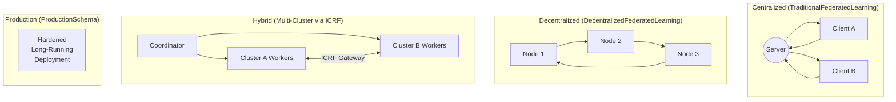

# Schemas SDK

FedPilot decouples *what* a node does (Schema) from *how* it is connected (Application) and *where* it runs (ICRF placement). Schemas live in `src/schemas/` and define the behavioral templates for federated learning paradigms.

---

## The Four Schema Families



### 1. Centralized (`src/schemas/centralized/`)

Traditional Server-Client FL. One server aggregates updates from all clients each round via `FedAvg` or `FedProx`. Used by `star_app_executor` and `shapley_app_executor`.

Each round:
1. Server broadcasts the global model.
2. All clients train locally for `number_of_epochs` epochs.
3. Clients upload weights to `GlobalObjectStore` and notify the server.
4. Server aggregates with the configured strategy and repeats.

### 2. Decentralized (`src/schemas/decentralized/`)

Fully peer-to-peer FL. No central server. Each node trains locally and exchanges weights only with its topological neighbors (as defined by the adjacency matrix enforced by the `TopologyManager`).

The template class is `DecentralizedFederatedLearningClientTemplate`. Each node independently decides when to aggregate based on what it has received from its neighbors.

### 3. Hybrid (`src/schemas/hybrid/`)

Multi-cluster deployment. A global Coordinator assigns subsets of clients to regional worker clusters. Clusters train semi-independently and synchronize via the `FederationMediator` and the **ICRF**. Each cluster runs a `HybridTopologyManager` that routes intra-cluster messages natively and inter-cluster messages via the `HybridClusterGateway`.

This is the schema family that activates the full ICRF stack.

### 4. Production (`src/schemas/production/`)

A hardened version of the centralized schema designed for stable, long-running real-world deployments. Reduced debug logging overhead, production-safe error handling, and configurable fault tolerance.

---

## Creating a Custom Schema

To build a new paradigm, inherit from `DecentralizedFederatedLearningClientTemplate` and override the four lifecycle hooks:

```python
from src.schemas.decentralized.decentralized_federated_learning_client_template import (
    DecentralizedFederatedLearningClientTemplate
)

class MyGossipSchema(DecentralizedFederatedLearningClientTemplate):

    def setup(self):
        """Initialize local model, dataset, and object store connection."""
        super().setup()
        # Add your own initialization here

    def train(self):
        """Run the local PyTorch optimizer loop for E epochs."""
        super().train()

    def aggregate(self, incoming_weights: list):
        """Define how to merge neighbor weights with your own."""
        # e.g., geometric median instead of weighted average
        from scipy.spatial.distance import cdist
        ...

    def sync(self):
        """Fetch incoming weight keys from the TopologyManager queue."""
        return super().sync()
```

The framework wires your schema into the Ray actors automatically. You define the algorithm; the ICRF handles the transport.

---

## Schema Constants

The actual string values used in `config.yaml` map to Python constants as follows:

| `config.yaml` value | Python Constant | Default Executor |
|---------------------|----------------|-----------------|
| `TraditionalFederatedLearning` | `TRADITIONAL_FEDERATED_LEARNING` | `star_app_executor` |
| `DecentralizedFederatedLearning` | `DECENTRALIZED_FEDERATED_LEARNING` | `ring/k_connect/custom` |
| `ProductionSchema` | `PRODUCTION_SCHEMA` | `production_executor` |

Hybrid mode is not activated by schema name — it is triggered automatically by the presence of `CLUSTER_0_ID` and `CLUSTER_ID` environment variables.

See also: [Applications & AppFactory](applications_and_appfactory.md) · [Inter-Cluster Ray Fabric (ICRF)](../federated_core/icrf.md)
