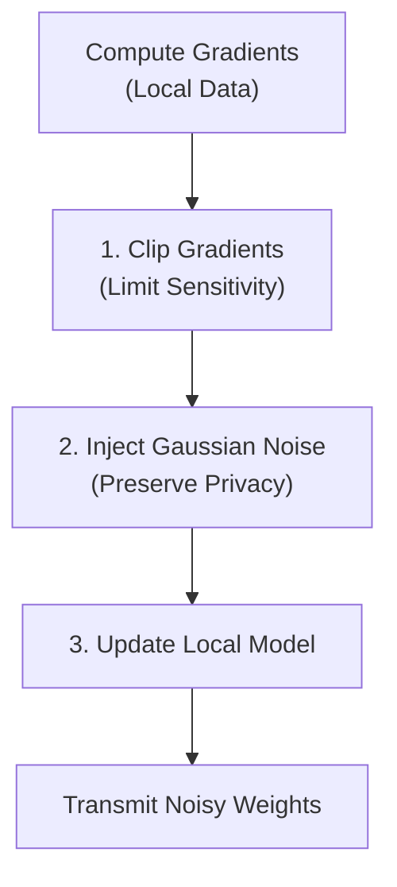

# Differential Privacy (DP-SGD)

In Federated Learning, transmitting raw weights instead of raw data provides baseline privacy. However, sophisticated inference attacks can still reverse-engineer sensitive data directly from the gradients.

FedPilot implements **Differential Privacy (DP-SGD)** to provide formal, mathematical guarantees that an individual client's data cannot be extracted from the model updates.

## The DP-SGD Algorithm
Differential privacy works by injecting controlled noise into the gradients *before* they leave the client node.



## Configuration & Trade-offs
Privacy comes at a direct cost to model accuracy. You control this trade-off using the `config.yaml`.

```yaml
dp_enabled: true
dp_epsilon: 1.0              # Privacy budget
dp_delta: 1e-5               # Failure probability
dp_clipping_norm: 1.0        # Maximum gradient magnitude
dp_noise_multiplier: 0.1     # Scale of the injected Gaussian noise
```

### 1. Epsilon ($\epsilon$)
The privacy budget. This is the most critical parameter:
- **$\epsilon < 1.0$**: Very strong privacy (Medical/Financial data). Causes significant accuracy loss.
- **$\epsilon \approx 1.0 - 5.0$**: The sweet spot. Good privacy with manageable accuracy degradation.
- **$\epsilon > 10.0$**: Weak privacy. Used mostly for debugging or public datasets.

### 2. Delta ($\delta$)
The probability that the privacy guarantee fails. A standard rule of thumb is to set $\delta = 1/N$, where $N$ is the total number of clients in your federation.

### 3. Clipping Norm & Sensitivity
Before noise is added, gradients that are too large (which might uniquely identify an outlier data point) are forcibly clipped down to the `dp_clipping_norm`. This bounds the "Sensitivity" of the function, ensuring the noise multiplier can successfully mask the updates.

## Troubleshooting DP
If your model refuses to converge with DP enabled:
1. **Diverging Loss**: Your `dp_noise_multiplier` is too high, or your `learning_rate` needs to be lowered to handle the noisy gradients.
2. **Stagnant Accuracy**: The `dp_clipping_norm` might be too aggressive (e.g., `0.1`). Try relaxing it to `1.0` or `2.0` to allow the model to actually learn from the data.
